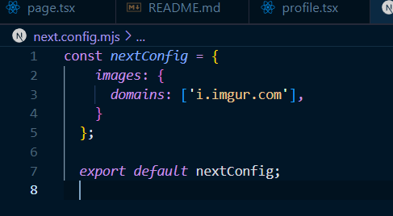
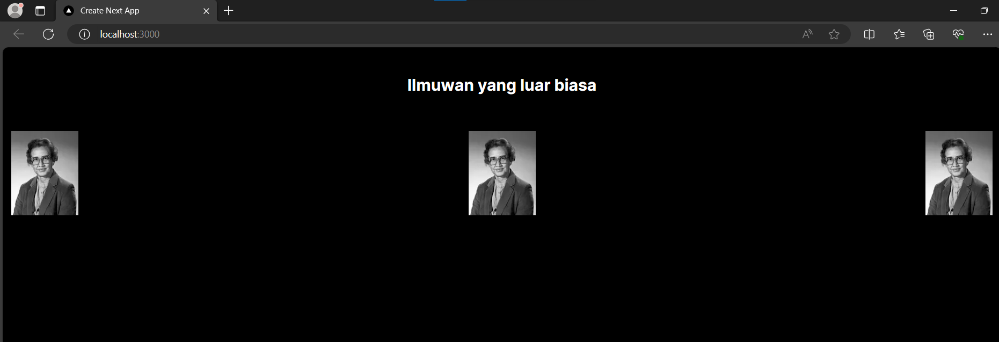
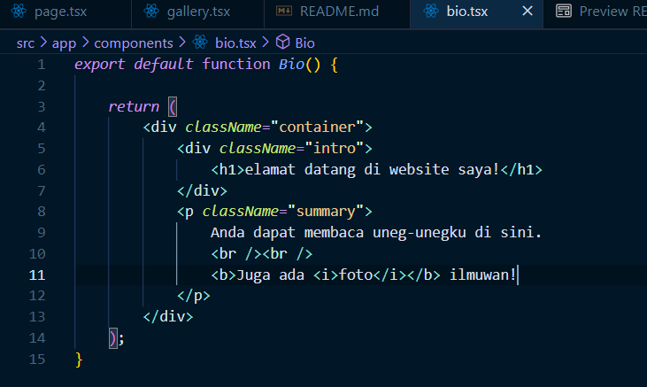

# Ikmal Faris Musyaffa
# 2141720123 / 06 / TI-3C
# Laporan Parktikum 3

## Praktikum 1
### Terdapat error karena tidak menulis host config pada next.config.mjs, solve error dengan menambahkan domain pada config.next.mjs
### Hasil dari praktikum 1


### Kode Program




## Praktikum 2
### Terdapat perbedaan dengan export dan export default, karena itu import nya juga berbeda
```bash
import Profile from "./components/profile";
import { Gallery } from "./components/gallery";
```
### Hasil dari praktikum 2




## Praktikum 3
### Sebelum

### Sesudah diperbaiki

### Pada jsx ternyata harus ada sebuah div atau <></> yang membungkus semua kode program di dalamnya. Pada kasus ini saya namai dengan container. Lalu kita tidak bisa menggunakan class="" tetapi menggunakan className="" dan yang terakhir terdapat penambahan penutupan tag yang hilan dan salah tempat.

## Soal no 5

### Tidak ada perbedaan dari tampilan

## Soal no 6


### Tidak lupa menambahkan garis miring atau / agar gambar bia muncul

# Praktikum 4
## Soal 7

### Terdapat fungsi getImageUrl yang mempunyai props berupa id gambar untuk mendapatkan gambar hanya dengan menginputkan id gambar pada fungsi getImageUrl tersebut.

## Soal 8
### Hasil

### Kode program

### destructuring pada jsx dan tsx sedikit berbeda karena di tsx menggunakan interface. Meskipun tidak menyebabkan error saat dirender tetapi pada tsx terdapat notifikasi error

## Soal 9
### Hasil

### Kode Program

### Bisa kita lihat bahwa card ini membungkus MyProfileV2 yang di mana card saya beri background biru. Pada tsx juga disarankan untuk mengimport ReactNode, jika tidak terdapat notifikasi error meskipun masih bisa dirender. Intinya tsx ini lebih aman dan lebih komunikatif dari segi efektivitas dan efisiensi.