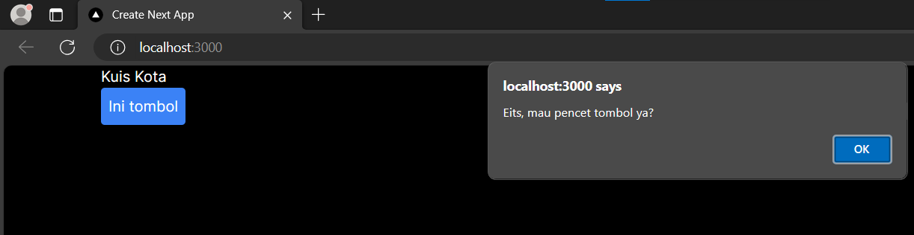
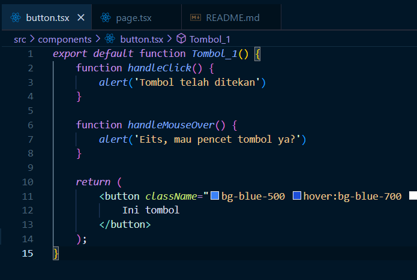
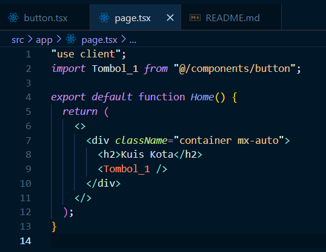
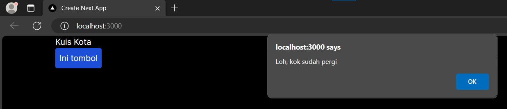

# Ikmal Faris Musyaffa
# 2141720123 / 06 / TI-3C
# Laporan Parktikum 4

## Praktikum 1

## Praktikum 2

### Jadi tombol 2 dapat menerima prop karena button tersebut juga function. dengan menambahkan props isiPesan dan namaTombol yang berupa any, kita dapat memasukkan pesan dan nama tombol saat memanggil button 2.