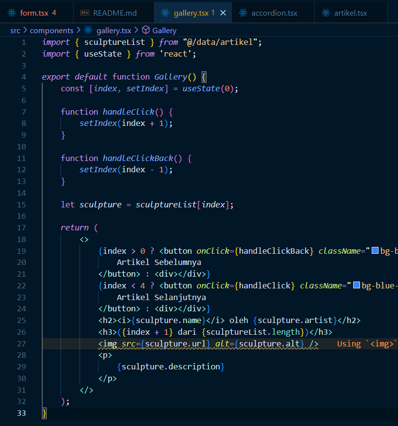

# Ikmal Faris Musyaffa
# 2141720123 / 06 / TI-3C
# Laporan Parktikum 4

## Praktikum 1

## Praktikum 2

### Jadi tombol 2 dapat menerima prop karena button tersebut juga function. dengan menambahkan props isiPesan dan namaTombol yang berupa any, kita dapat memasukkan pesan dan nama tombol saat memanggil button 2.

## Praktikum 3

## Praktikum 4

### jika sebanyak lebih dari 5 kali akan terjadi error karena index pada sculptureList hanya sampai 5 index yaitu 0-4.
## Modifikasi Program

### Jadi saya menambahkan fungsi handleClickBack untuk mengurangi index dan membuat pernyataan bahwa jika indek kurang dari 4 maka tampilkan selanjutnya, jika index lebih dari 0 maka tampilkan sebelumnya. kedua if ini berjalan secara terpisah, jadi jika kedua kondisi ini terpenuhi maka kedua tombol akan tampil.

## Praktikum 5

### 1. Perbedaannya adalah form_2 yang kedua lebih simple dan tidak terjadi redundansi. Jadi lebih efektif dan eifisien.
### 2. Karena sebenarnya kita tidak memerlukan fullName, hanya dengan menggunakan firstName dan lastName saja sudah cukup untuk membuat full name tanpa fullName.

## Praktikum 6

### sepengertian saya, dengan memberi key yang berupa email akan mengatur ulang input dari text area tersebut. Jika tidak diberi key maka ketika kita input pesan di textarea pada salah satu kontak, jika kita mengganti kontak maka input tersebut masih tersimpan, dan hal ini dapat membuat kita salah kirim pesan. Dengan memberi key tersebut, input text area akan hilang dan diatur ulang jika kita mengganti kontak