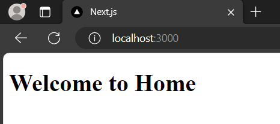
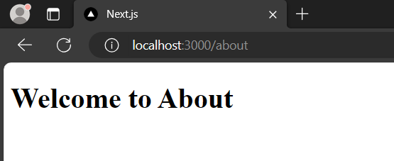
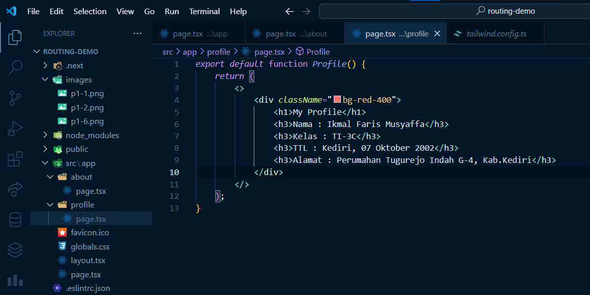
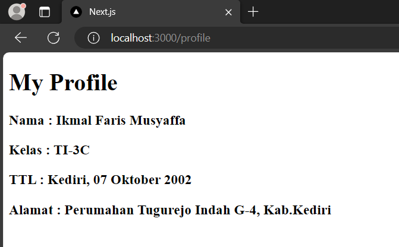
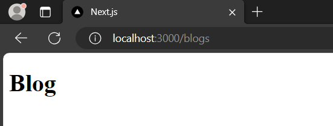
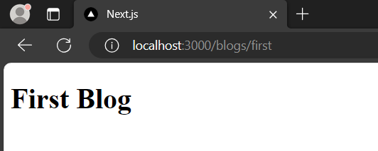
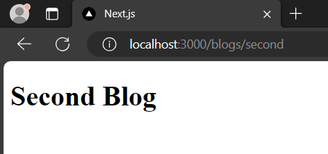

# Ikmal Faris Musyaffa
# 2141720123 / 06 / TI-3C
# Laporan Pertemuan 5

## Praktikum 1

## To Do
### Membuat Halaman Profile dengan Routing

### TailwindCSS pada project ini tidak berjalan dengan baik

## Praktikum 2

## To Do
### Melengkapi blogs/second

## Menjawab Pertanyaan
### Kekurangan yang mungkin adalah menjadi tambah kompleks dan ketika ingin membuat dua halaman first dan second, jika masuk ke folder blogs tetapi tidak ada page.tsx, halaman tersebut tidak ada. Dengan kata lain jika kita hanya ingin menampilkan first dan second, secara tidak langsung kita harus membuat tiga page.tsx sedangkan dengan pendekatan praktikum 1, kita hanya membuat folder first dan second.

## Praktikum 3

