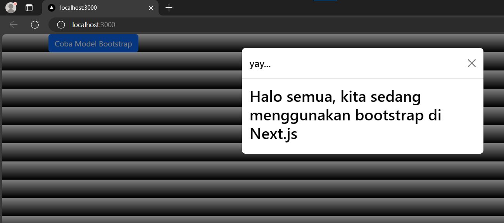
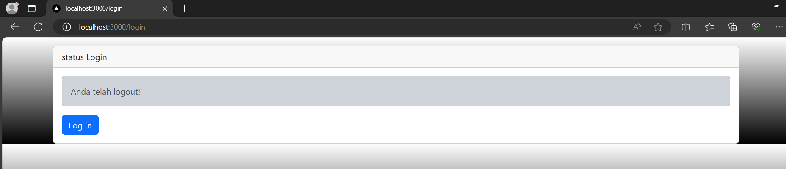
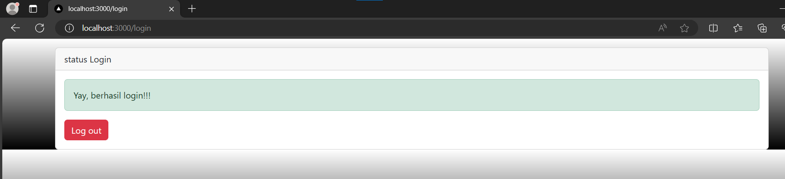

# Ikmal Faris Musyaffa
# 2141720123 / 06 / TI-3C
# Laporan Pertemuan 6

## Praktikum 1

### Berhasil menerapkan bootstrap pada next.js

## Praktikum 2

### Saat /login dibuka sudah berada di keadaan login
### Jika tanpa menggunakan parse tidak bisa karena tujuan dari parse adalah untuk mengkonversi baris html menjadi javascript. Karena biasanya java script mengguanakan className sedangkan ini hanya menggunakan class. Lalu jika tidak memakai parse terdapat error jsx harus punya parent class yang dimana tidak dapat digunakan di ternary operation seperti ini, jadi menggunakan parse merupakan langkah yang baik dan efektif serta efisien.
