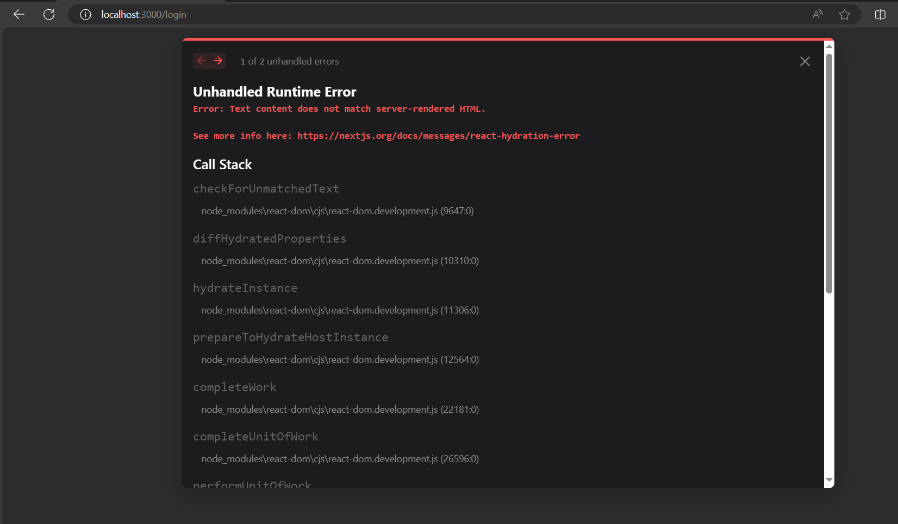
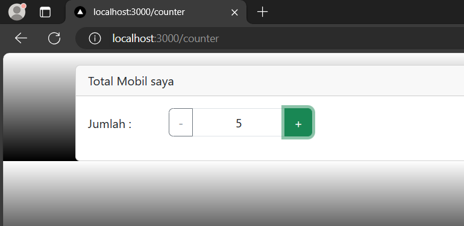

# Ikmal Faris Musyaffa
# 2141720123 / 06 / TI-3C
# Laporan Pertemuan 6

## Praktikum 1

### Berhasil menerapkan bootstrap pada next.js

## Praktikum 2
## Soal 1

### Saat /login dibuka sudah berada di keadaan login

### Terjadi error karena menurut saya pada authSlice terdapat initialState isLogin: false di mana hasilnya jika ke /login maka memang di set ke anda telah logout. Nah kerana kita pencet login dan kita berada di state di mana islogin pada local storage menjadi true, lalu direfresh 

## Soal 2
### Jika tanpa menggunakan parse tidak bisa karena tujuan dari parse adalah untuk mengkonversi baris html menjadi javascript. Karena biasanya java script mengguanakan className sedangkan ini hanya menggunakan class. Lalu jika tidak memakai parse terdapat error jsx harus punya parent class yang dimana tidak dapat digunakan di ternary operation seperti ini, jadi menggunakan parse merupakan langkah yang baik dan efektif serta efisien.

## Praktikum 3

## Tugas Pertanyaan
### 1. useEffect adalah salah satu dari banyak hooks yang disediakan oleh React. Hooks memungkinkan Anda untuk menggunakan fitur-fitur React di dalam komponen fungsional. useEffect khususnya digunakan untuk menangani efek samping dalam komponen fungsional. Efek samping ini bisa berupa pembuatan, pemutakhiran, atau penghapusan data, langganan ke data eksternal, atau pembaruan DOM.

### 2. Tidak ada hal signifikan yang terjadi

### 3. karena class adalah kata kunci dalam JavaScript yang digunakan untuk mendefinisikan kelas. Karena JSX (JavaScript XML) digunakan dalam React dan Next.js untuk menulis markup HTML dalam JavaScript, penggunaan class sebagai atribut untuk menetapkan kelas CSS akan menyebabkan konflik dengan kata kunci class dalam JavaScript. Oleh karena itu, untuk menghindari konflik, digunakanlah className sebagai alternatif untuk menetapkan kelas CSS pada elemen HTML.

### 4. Ya, store pada Next.js dapat menyimpan banyak reducer Redux. Redux menyediakan kemampuan untuk menggabungkan beberapa reducer ke dalam satu store menggunakan fungsi combineReducers.

### 5. Digunakan untuk mencatat apa saja redux yang digunakan, dan agar bisa digunakan harus ditamabahkan ke store.

### 6. Untuk menginisialisasi state yang terjadi saat itu pada aplikasi. state.auth bisa mengakses nilai isLogin dari store yang di mana bisa true atau false, dengan kata lain sudah login atau belm login

### 7. Untuk mengambil nilai counter saat ini yang sudah ditambah atau belum. Jadi totalCounter mengambil nilai state yang sudah ditambah atau dikurang menggunakan tombol tambahNilai() dan kurangNilai()