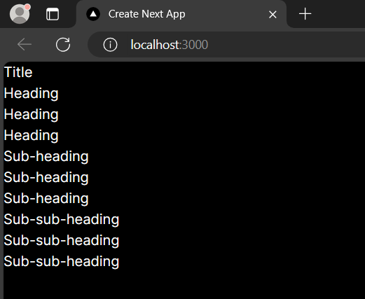

# Ikmal Faris Musyaffa
# 2141720123 / 06 / TI-3C
# Laporan Pertemuan 7 Context

## Praktikum 1

### Main page merupakan template dan main page memanggil heading dan section. Heading mempunyai level dan jika level 1 maka h1 dan seterusnya. 

### Dengan menggunakan context, tidak perlu menuliskan level pada setiap heading. Kita bisa menuliskan level pada section dan menggunakan context agar heading mencari context tersebut dan mengimplementasikan case dan mencari variabel "level" pada section

## Praktikum 2

## Praktikum 3

